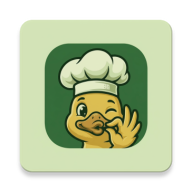

# 🍽️ CheffsKiss

<p align="center">
  
</p>

<p align="center">
  <strong>Your personal cooking assistant for Android</strong><br/>
  Discover recipes, plan your weekly meals and cook step by step — without distractions.
</p>

<p align="center">
  
  
  
  
  
</p>

---

## What is CheffsKiss?

CheffsKiss is an Android app for cooking enthusiasts. You can explore a recipe catalogue, create your own recipes, plan what you'll eat each day of the week, and follow any recipe's steps in a cooking mode specially designed so you barely need to touch your phone.

The app is built to be **fast, visual and friction-free**: from the moment you open it to the moment the dish is on the table, everything flows naturally.

---

## ✨ Features

### 🔍 Explore Recipes
Browse community recipes by **title** or by the **ingredients you already have at home**. The reverse ingredient search suggests what you can cook with what's available in your fridge — no supermarket trip required.

### ✍️ Create & Edit Your Recipes
Add your own recipes with:
- Name, description and cover photo
- Ingredient list with amounts and units of measurement
- Detailed steps with an estimated duration for each one
- Recipe status (draft or published)

### 🎯 Focus Mode — Hands-Free Cooking
**Focus Mode** is CheffsKiss's flagship feature. When activated, the app transforms into an immersive cooking assistant:

- Navigate between steps with a simple **swipe** or on-screen buttons
- A **circular timer** counts down the estimated time for each step
- The **screen stays on** so you never need to unlock your phone with messy hands
- Enable **large text mode** to read from across the kitchen
- Need to step away? **Save your progress** and pick up right where you left off
- Mark ingredients as used as you go through each step

### 📅 Meal Planner
Organise your week with the **Meal Planner**:
- Assign recipes to each day of the week and meal type (breakfast, lunch, dinner…)
- Manage multiple plans and set one as active
- See at a glance what you're cooking every day

### 📚 Collections
Save your favourite recipes into **custom collections**: "Summer recipes", "Dishes to impress guests", "My go-tos"… you decide how to organise them. You can also save individual recipes to your personal library.

### 👤 Profiles & Community
Every user has their own profile showcasing their published recipes. Visit other cooks' profiles and discover new dishes to try.

### 🔐 User Account
Sign up with email and password. Your recipes, collections and meal plans sync automatically to the cloud and are accessible from any Android device.

---

## 📱 Screenshots

<p align="center">
  
  &nbsp;&nbsp;
  
  &nbsp;&nbsp;
  
  &nbsp;&nbsp;
  
</p>

<p align="center">
  <em>Home &nbsp;·&nbsp; Explore Recipes &nbsp;·&nbsp; Focus Mode &nbsp;·&nbsp; Meal Planner</em>
</p>

---

## 🚀 Getting Started

### Requirements

- Android 8.0 (Oreo) or higher
- Android Studio Hedgehog or higher (to build from source)
- A Firebase account (for the backend)

### Build from Source

1. **Clone the repository**
   ```bash
   git clone https://github.com/your-username/cheffskiss.git
   cd cheffskiss
   ```

2. **Set up Firebase**
    - Create a project at [Firebase Console](https://console.firebase.google.com)
    - Enable **Authentication** (Email/Password), **Firestore** and **Storage**
    - Download `google-services.json` and place it inside the `app/` folder

3. **Configure the photo API** *(optional)*

   Add the following to your `local.properties` file (not versioned):
   ```properties
   recipe.photo.api.key=YOUR_KEY_HERE
   recipe.photo.base.url=https://plytrox.com/photos
   ```

4. **Build and run**
   ```bash
   ./gradlew assembleDebug
   ```
   Or open the project in Android Studio and hit ▶️ **Run**.

---

## 🛠️ Tech Stack

CheffsKiss is built with **Kotlin** and **Jetpack Compose**, following a Hexagonal Architecture (Ports & Adapters) that cleanly separates business logic from the UI and infrastructure. The backend runs entirely on **Firebase** (authentication, real-time database with Firestore, and image storage). Recipe images are loaded with **Coil** and all navigation uses Navigation Compose.

| Layer | Responsibility |
|---|---|
| **UI** | Compose screens, ViewModels, navigation |
| **Application** | Commands, queries, domain services |
| **Domain** | Recipes, meal plans, collections, user |
| **Infrastructure** | Firebase, local storage, networking |

---

## 👥 Team

<table>
  <tr>
    <td align="center"><b>Javier Castilla</b></td>
    <td align="center"><b>Asmae Ez Zaim</b></td>
    <td align="center"><b>Daniel Gutiérrez</b></td>
    <td align="center"><b>Alejandro van Baumberghen</b></td>
  </tr>
  <tr>
    <td align="center">
      <a href="https://github.com/javcastilla">
        
      </a>
    </td>
    <td align="center">
      <a href="https://github.com/A-NullPointer">
        
      </a>
    </td>
    <td align="center">
      <a href="https://github.com/DanGutRec">
        
      </a>
    </td>
    <td align="center">
      <a href="https://github.com/Alejandrovb01">
        
      </a>
    </td>
  </tr>
</table>

> (PDIGS) Course Project at the **University of Las Palmas de Gran Canaria (ULPGC)** — Bachelor's Degree in Computer Engineering.

---

## 🤝 Contributing

Contributions are welcome! Please:

1. Fork the project
2. Create your feature branch (`git checkout -b feature/amazing-feature`)
3. Commit your changes (`git commit -m 'feat: add amazing feature'`)
4. Push to the branch (`git push origin feature/amazing-feature`)
5. Open a Pull Request

---

## 📄 License

Distributed under the **Apache 2.0 License**. See [LICENSE](LICENSE) for more information.

---

<p align="center">Made with ❤️ and Jetpack Compose · ULPGC 2026</p>
